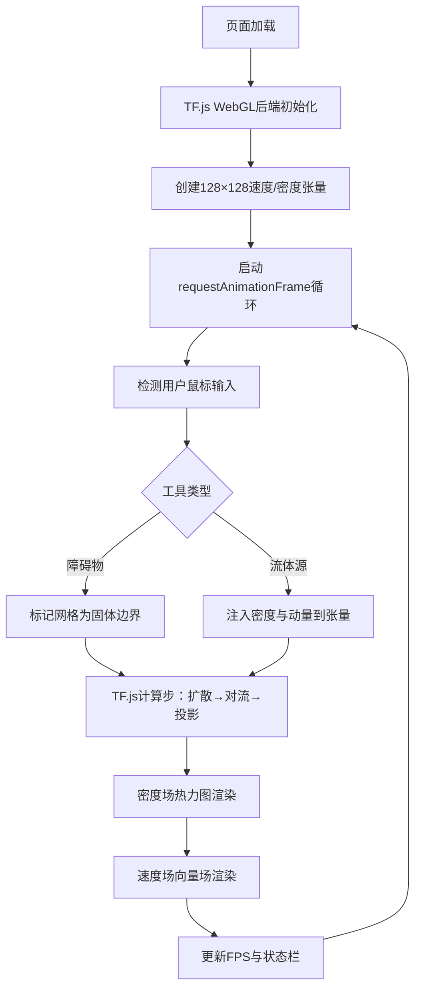

## 1. 产品概述
基于浏览器的实时2D流体仿真可视化平台，采用Navier-Stokes方程简化模型，利用TensorFlow.js在GPU上并行计算，为用户提供交互式的流体动力学实验环境。
- 面向对计算流体力学(CFD)、可视化艺术、游戏特效感兴趣的开发者、研究者和爱好者
- 以低门槛、高性能、强交互为核心价值，将复杂的物理仿真转化为直观可操作的浏览器体验

## 2. 核心功能

### 2.1 功能模块
1. **仿真主画布**：128×128网格流体仿真，实时渲染密度场热力图与速度场向量场
2. **交互工具栏**：障碍物绘制（圆形/矩形）、流体源喷射（多色粒子）、工具切换
3. **参数控制面板**：粘度滑块、力场强度滑块、仿真启停控制
4. **状态显示区**：FPS帧率、网格分辨率、当前模式提示

### 2.2 页面详情
| 页面名称 | 模块名称 | 功能描述 |
|-----------|-------------|---------------------|
| 主页面 | 仿真画布区域 | 居中显示Canvas，鼠标拖拽根据当前模式生成障碍物或流体源 |
| 主页面 | 顶部工具栏 | 工具切换按钮（选择/圆形障碍/矩形障碍/流体源/清除） |
| 主页面 | 右侧控制面板 | 粘度滑块(0.0001~0.01)、力场强度滑块(0.1~10)、暂停/继续按钮 |
| 主页面 | 底部状态栏 | 显示实时FPS、网格尺寸、当前激活工具 |

## 3. 核心流程
用户打开页面 → TF.js初始化GPU后端 → 仿真循环启动 → 用户选择工具并在画布拖拽 → 交互数据写入仿真网格 → TF.js执行扩散/对流/投影求解 → 渲染密度热力图与速度向量 → 循环下一帧

## 4. 用户界面设计

### 4.1 设计风格
- **主色调**：深空蓝黑背景(#0a0e1a) + 霓虹青蓝(#00f0ff)点缀 + 热力彩虹渐变
- **按钮风格**：玻璃拟态(Glassmorphism)，半透明磨砂背景，发光边框，圆角10px
- **字体**：标题使用 Orbitron（科技感等宽），正文使用 JetBrains Mono
- **布局风格**：三栏式（左工具+中画布+右参数），绝对定位叠加控制面板
- **图标风格**：SVG线性图标，霓虹发光效果

### 4.2 页面设计概述
| 页面名称 | 模块名称 | UI Elements |
|-----------|-------------|-------------|
| 主页面 | 仿真画布 | 800×800px居中Canvas，深色背景带网格纹理，拖拽时光标跟随光晕 |
| 主页面 | 左工具栏 | 垂直排列5个圆形工具按钮，选中时外圈霓虹脉冲动画 |
| 主页面 | 右控制面板 | 半透明白色玻璃卡片，滑块带渐变轨道，数值实时显示 |
| 主页面 | 状态栏 | 底部浮层，等宽字体显示数据，FPS变色警告(<30黄色/<15红色) |

### 4.3 响应式
- 桌面优先设计，最小支持1280px宽度
- Canvas区域自适应缩放保持正方形比例
- 移动端降级为上下布局（画布+堆叠控制面板）

### 4.4 视觉特效
- 背景：CSS径向渐变+噪点纹理叠加
- 工具按钮：hover时scale(1.1)+发光扩散
- 滑块：拖动时滑块点放大并发光
- 画布：鼠标悬浮位置显示动态十字准星光晕
