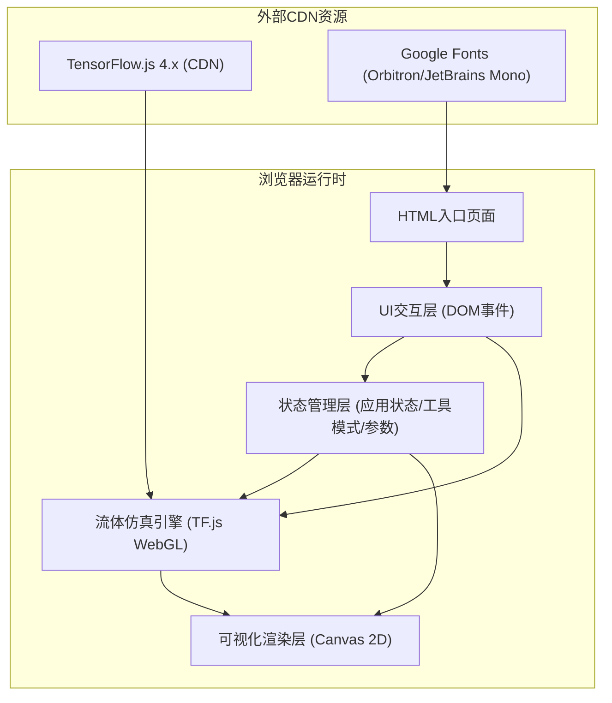
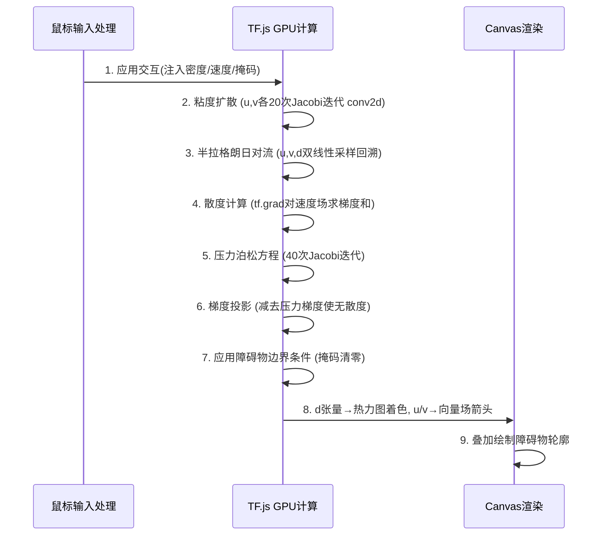

## 1. 架构设计
纯前端单页应用架构，无后端服务。TensorFlow.js WebGL后端负责GPU加速的流体物理计算，Canvas 2D API负责可视化渲染。



## 2. 技术描述
- **前端框架**：原生 HTML5 + CSS3 + ES2020 JavaScript（无构建工具，直接CDN加载）
- **GPU计算库**：TensorFlow.js 4.14.0，使用WebGL后端
- **渲染技术**：HTML5 Canvas 2D Context，ImageData批量像素写入
- **字体资源**：Google Fonts CDN加载 Orbitron (标题) + JetBrains Mono (正文)
- **项目初始化**：直接创建index.html单文件，所有内联或CDN依赖

## 3. 文件结构
| 路径 | 用途 |
|-------|---------|
| `/index.html` | 单页面入口，包含所有HTML结构、内联CSS与JS逻辑 |

## 4. 数据结构（核心张量定义）
### 4.1 TF.js张量规格
| 张量名 | Shape | 数据类型 | 说明 |
|--------|-------|----------|------|
| `u` | [1, 128, 128, 1] | float32 | x方向速度场 |
| `v` | [1, 128, 128, 1] | float32 | y方向速度场 |
| `d` | [1, 128, 128, 1] | float32 | 密度场（多种颜色通道可扩展为3通道） |
| `mask` | [1, 128, 128, 1] | float32 | 障碍物掩码 (0=流体, 1=固体) |
| `div` | [1, 128, 128, 1] | float32 | 速度散度（中间量） |
| `p` | [1, 128, 128, 1] | float32 | 压力场（中间量） |

### 4.2 应用状态对象
```javascript
{
  tool: 'select' | 'circle' | 'rect' | 'source' | 'clear',  // 当前工具
  viscosity: 0.001,        // 粘度系数
  forceScale: 2.0,         // 力场强度缩放
  paused: false,           // 仿真暂停标志
  isDrawing: false,        // 鼠标拖拽中
  drawStart: {x,y},        // 拖拽起点
  drawCurrent: {x,y},      // 拖拽当前点
  sourceColor: [h,s,l],    // 流体源颜色HSL
  fps: 60,                 // 当前帧率
  gridSize: 128            // 网格分辨率
}
```

## 5. 仿真算法流程（每帧执行）


## 6. 关键实现点
### 6.1 扩散（Diffusion）
使用3×3拉普拉斯卷积核的Jacobi迭代：
```
核 = [[0,1,0],[1,-4,1],[0,1,0]]
x_new = (x + a * conv2d(x, kernel)) / (1 + 4*a)
```
其中a = dt * viscosity * gridSize²

### 6.2 半拉格朗日对流（Advection）
对每个网格点(i,j)，回溯到上一时刻位置(i-u*dt, j-v*dt)，用双线性采样从原张量取值。

### 6.3 压力投影（Projection）
1. 计算散度：div = ∂u/∂x + ∂v/∂y
2. 迭代求解泊松方程：∇²p = div
3. 修正速度：u -= ∂p/∂x, v -= ∂p/∂y

### 6.4 热力图配色
密度值→HSL颜色映射：H=240(蓝)→0(红)，S=80%，L=50%+d*20%，叠加透明度衰减。
